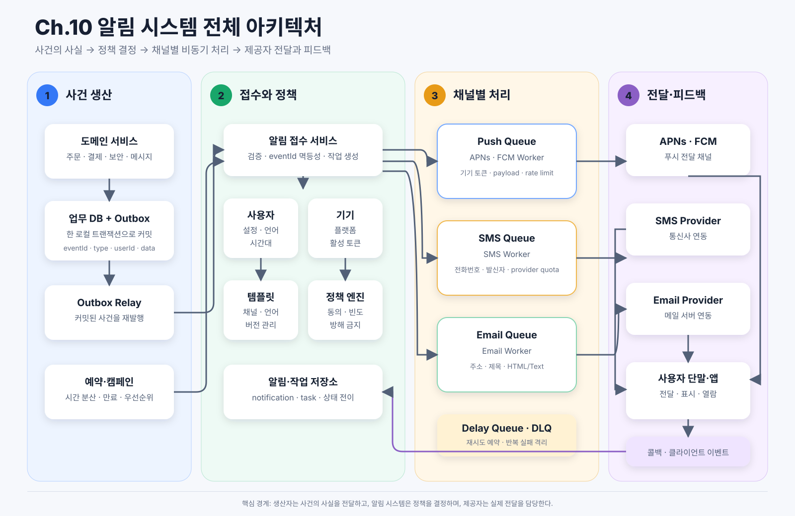
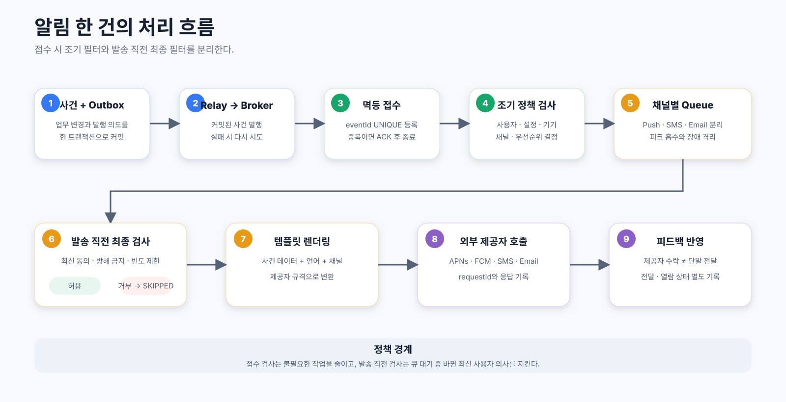
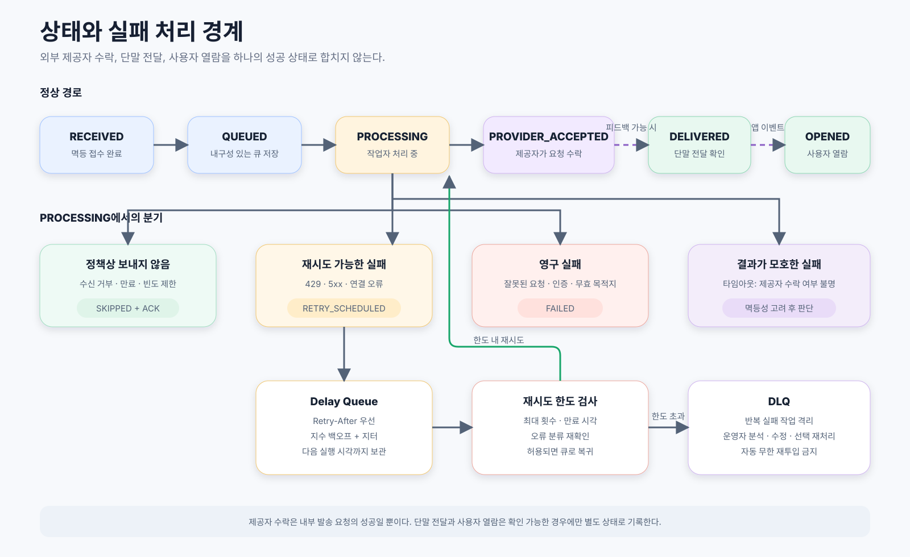

# 알림 시스템 설계

알림 시스템은 주문 상태 변경, 보안 경고, 메시지 도착처럼 다른 서비스에서 발생한 사건을 사용자에게 전달한다. 푸시·SMS·이메일을 한 번 호출하는 기능처럼 보이지만, 대규모 환경에서는 외부 제공자의 지연과 장애를 격리하고, 같은 알림이 중복 발송되지 않게 하며, 사용자의 최신 수신 설정을 지키는 일이 더 어렵다.

이 설계의 핵심은 **생산자가 사건의 사실을 전달하고, 알림 시스템이 정책과 채널을 결정하며, 외부 제공자가 실제 전달을 담당하도록 책임을 분리하는 것**이다.

## 1. 요구사항

### 기능 요구사항

- 모바일 푸시, SMS, 이메일을 지원한다.
- 다른 서비스의 이벤트와 예약 작업으로 알림을 만들 수 있다.
- 사용자별·알림 유형별·채널별 수신 설정을 적용한다.
- 사용자 언어와 채널에 맞는 템플릿으로 메시지를 만든다.
- 한 사용자의 여러 기기에 푸시를 보낼 수 있다.
- 일시적인 외부 제공자 장애는 정책에 따라 재시도한다.
- 같은 사건이 다시 전달되어도 중복 알림을 최소화한다.
- 접수, 큐 저장, 제공자 수락, 단말 전달, 사용자 열람 상태를 구분한다.

### 비기능 요구사항

- **확장성**: 채널별 작업자를 독립적으로 수평 확장할 수 있어야 한다.
- **가용성**: 한 채널이나 제공자의 장애가 다른 채널과 생산자에게 전파되지 않아야 한다.
- **내구성**: 업무 데이터가 커밋된 뒤 알림 사건이 유실되지 않아야 한다.
- **지연 시간**: 보안·거래 알림은 수 초 안에 발송을 시작하되, 엄격한 실시간보다는 soft real-time을 목표로 한다.
- **정책 준수**: 마케팅 수신 거부, 방해 금지 시간, 빈도 제한을 발송 시점의 최신 값으로 적용한다.
- **관측성**: 내부 처리 성공과 실제 전달·열람을 서로 다른 지표로 측정한다.

### 설계 전에 면접관과 확인할 것

| 질문 | 설계에 미치는 영향 |
| --- | --- |
| 어떤 채널을 지원하는가? | 채널별 큐, 작업자, 제공자 어댑터의 범위를 결정한다. |
| 어떤 알림이 즉시성·필수성이 높은가? | 우선순위 큐, 만료 시간, 재시도 한도를 다르게 둔다. |
| 사용자는 채널과 유형별로 수신을 거부할 수 있는가? | 설정 모델과 발송 직전 재검사가 필요하다. |
| 한 사용자가 여러 기기를 가지는가? | 사용자와 기기 토큰을 1:N으로 관리한다. |
| 예약·대량 발송도 포함하는가? | 스케줄러, 속도 평탄화, 캠페인별 처리율 제한이 필요하다. |
| 전달 순서가 중요한가? | 사용자·주문 등의 키로 파티셔닝하거나 순서 번호를 둔다. |
| 제공자 수락과 단말 전달 중 어디까지 보장하는가? | 상태 모델, SLA, 피드백 수집 방식이 달라진다. |

## 2. 개략적 규모 추정

책의 예시와 비슷한 가정으로 설계를 구체화한다.

- 푸시: 하루 1,000만 건 → 평균 약 `116건/초`
- SMS: 하루 100만 건 → 평균 약 `12건/초`
- 이메일: 하루 500만 건 → 평균 약 `58건/초`
- 전체: 하루 1,600만 건 → 평균 약 `185건/초`
- 피크를 평균의 10배로 가정하면 약 `1,850건/초`

평균 처리량만 보면 작아 보이지만, 정각 캠페인이나 스포츠 경기·재난·서비스 장애처럼 특정 시점에 트래픽이 몰릴 수 있다. Firebase도 정각 전후 트래픽 급증과 재시도 증폭을 대표적인 혼잡 원인으로 설명한다. 따라서 용량은 일평균보다 **피크 유입률과 허용 가능한 큐 지연 시간**을 기준으로 잡아야 한다.

### 저장 공간과 버퍼

- 한 달 알림 작업 수: `1,600만 × 30 = 4억 8,000만 건`
- 작업·전달 기록을 평균 1KB로 잡으면 월 약 `480GB`
- 1년 원본 보관 시 약 `5.8TB`이며 인덱스, 복제, 메트릭은 별도다.
- 피크 1,850건/초에서 제공자가 10분 멈추면 약 `111만 건`이 대기한다.
- 큐 메시지를 평균 2KB로 보면 순수 payload만 약 `2.2GB`다.

모든 전달 기록을 같은 기간 보관할 필요는 없다. 최근 상세 이력은 운영 DB에 두고, 오래된 이력은 압축된 분석 저장소로 옮기는 계층화가 필요하다.

## 3. 단순 설계에서 최종 설계까지

### 3.1 생산자가 외부 제공자를 직접 호출

가장 단순한 방식은 주문 서비스가 APNs·FCM·SMS·이메일 제공자를 직접 호출하는 것이다.

- 장점: 구현이 빠르고 구성 요소가 적다.
- 문제: 제공자 지연이 주문 요청에 전파된다.
- 문제: 모든 생산자가 채널 규격, 인증, 재시도, 템플릿 정책을 알아야 한다.
- 문제: 여러 서비스가 각자 구현하므로 수신 거부와 빈도 제한이 일관되지 않는다.

### 3.2 중앙 알림 서비스 도입

생산자는 알림 서비스 하나만 호출하고, 알림 서비스가 사용자·템플릿·채널 정책을 관리한다. 책임은 모이지만 외부 제공자를 동기로 호출하면 트래픽 급증과 장애 전파 문제가 남는다.

### 3.3 채널별 큐와 작업자 도입

알림 작업을 채널별 큐에 저장하고 작업자가 비동기로 외부 제공자를 호출한다.

- 생산자와 외부 제공자의 처리 속도를 분리한다.
- 순간적인 트래픽 급증을 큐가 흡수한다.
- SMS 장애와 재시도가 푸시·이메일 처리 용량을 잠식하지 않는다.
- 채널마다 작업자 수, 처리율, 재시도와 성공 기준을 다르게 운영한다.

### 3.4 아웃박스와 소비자 멱등성 추가

업무 DB 갱신과 이벤트 발행을 따로 수행하면 둘 사이의 장애 창에서 사건이 유실된다. 생산자는 업무 데이터와 아웃박스 레코드를 같은 로컬 트랜잭션으로 커밋하고, 별도 릴레이가 커밋된 레코드를 큐로 발행한다.

다만 릴레이가 큐 발행에 성공한 뒤 아웃박스 상태를 바꾸기 전에 죽으면 같은 사건을 다시 발행할 수 있다. 따라서 아웃박스는 **유실을 막지만 중복까지 없애지는 않는다**. 소비자는 `eventId`를 고유 키로 기록하여 같은 사건의 재처리를 막아야 한다.

## 4. 최종 아키텍처

전체 구조는 네 영역으로 나뉜다.

1. **사건 생산**: 서비스와 예약 작업이 사건을 만들고 아웃박스 또는 알림 API로 전달한다.
2. **접수와 정책 결정**: 멱등성을 확인하고 사용자 설정, 기기, 템플릿, 빈도 제한을 적용한다.
3. **채널별 비동기 처리**: 푸시·SMS·이메일 큐와 작업자가 서로 독립적으로 동작한다.
4. **외부 전달과 피드백**: 제공자 요청·응답, 단말 전달, 열람 이벤트를 별도 상태로 기록한다.

### 구성 요소별 역할

| 구성 요소 | 역할 |
| --- | --- |
| 도메인 서비스 | 주문·결제·보안 등 실제 사건을 만든다. |
| 아웃박스 릴레이 | 커밋된 사건을 브로커에 발행하고 재처리한다. |
| 알림 접수 서비스 | 입력 검증, `eventId` 멱등성 확인, 알림 작업 생성 |
| 사용자·설정 저장소 | 연락처, 채널·유형별 동의, 언어, 시간대 관리 |
| 기기 저장소 | 사용자별 APNs·FCM 토큰, 플랫폼, 활성 상태 관리 |
| 템플릿 저장소 | 알림 유형·언어·채널별 제목과 본문 관리 |
| 정책 엔진 | 수신 거부, 방해 금지 시간, 빈도 제한, 우선순위 적용 |
| 채널별 큐 | 트래픽 버퍼, 장애 격리, 독립적인 확장 단위 제공 |
| 채널 작업자 | 템플릿 렌더링, 발송 직전 정책 검사, 제공자 호출 |
| 제공자 어댑터 | APNs·FCM·SMS·이메일 API 차이를 내부 인터페이스로 숨김 |
| 전달 이력 저장소 | 시도 횟수, 제공자 응답, 상태 전이와 오류 원인 기록 |
| 콜백·클라이언트 이벤트 수집기 | 제공자 피드백, 단말 전달·열람 이벤트 반영 |

## 5. 사건 계약과 책임 경계

생산자는 채널별 완성 문구보다 **발생한 사건의 사실**을 전달한다.

| 정보 | 예시 | 책임 |
| --- | --- | --- |
| 사건 식별자 | `eventId` | 같은 사건의 중복 처리 방지 |
| 사건 출처·유형 | 주문 서비스, 결제 실패 | 라우팅과 추적 |
| 수신자 식별자 | `userId` | 사용자 설정·연락처 조회 |
| 알림 유형 또는 템플릿 | 비밀번호 변경 완료 | 언어·채널별 템플릿 선택 |
| 사건 데이터 | 변경 시각, 기기명, 위치 | 최종 문구 생성 |
| 발생 시각·만료 시각 | `occurredAt`, `expiresAt` | 오래된 알림 폐기와 순서 판단 |

비밀번호 변경 서비스가 한국어 문구를 완성해서 보내면 같은 사건을 영어 이메일이나 SMS로 확장할 때 생산자도 수정해야 한다. 대신 변경 시각·기기명·위치 같은 사실을 보내면 알림 서비스가 사용자 언어와 채널별 템플릿으로 렌더링할 수 있다.

### 알림 서비스와 외부 제공자의 경계

- **알림 서비스**: 누가 어떤 알림을 받을지 결정하고, 최신 설정과 기기 토큰을 조회하며, 채널 규격에 맞는 요청을 생성한다.
- **APNs·FCM·SMS·이메일 제공자**: 전달 요청을 받아 각 단말이나 네트워크로 전달한다.
- **사용자 단말과 앱**: 알림을 표시하고, 가능한 경우 전달·열람 이벤트를 다시 보낸다.

Apple의 공식 문서도 제공자 서버가 알림 데이터와 기기 식별자를 APNs에 보내고, APNs가 사용자 기기로 전달하는 구조로 설명한다. APNs나 FCM은 전체 알림 정책 시스템이 아니라 마지막 전달 채널이다.

## 6. 발송 처리 흐름

1. 생산자가 사건과 아웃박스 레코드를 같은 트랜잭션으로 저장한다.
2. 릴레이가 사건을 브로커에 발행한다.
3. 알림 접수 서비스가 `eventId`를 원자적으로 등록한다. 이미 존재하면 중복으로 종료한다.
4. 사용자, 채널별 수신 설정, 활성 기기, 언어와 시간대를 조회한다.
5. 알림 유형과 우선순위에 따라 대상 채널과 만료 시각을 정한다.
6. 채널별 작업을 생성하고 각 큐에 넣는다.
7. 작업자가 발송 직전에 최신 수신 설정과 빈도 제한을 다시 확인한다.
8. 템플릿에 사건 데이터를 넣고 제공자별 요청으로 변환한다.
9. 외부 제공자의 응답을 기록한다.
10. 콜백이나 클라이언트 이벤트가 있으면 전달·열람 상태를 별도로 갱신한다.

### 수신 설정을 두 번 확인하는 이유

접수 시점의 검사는 불필요한 작업 생성을 줄이는 **조기 필터**다. 하지만 큐에서 기다리는 동안 사용자가 마케팅 알림을 끌 수 있으므로 작업자는 발송 직전에 다시 확인해야 한다.

- 허용: 제공자 요청 생성과 발송
- 거부: `SKIPPED` 기록 후 큐 메시지를 ACK하고 종료

재검사는 새 이벤트를 만들거나 무한 재시도하는 과정이 아니라, 현재 작업을 발송할지 종료할지 결정하는 조건 검사다.

### 여러 기기 처리

한 사용자는 여러 활성 기기 토큰을 가질 수 있다. 사용자 단위 알림 작업을 기기 단위 전달 시도로 확장하되 다음 정책을 정해야 한다.

- 모든 활성 기기로 보낼지, 최근 활성 기기로만 보낼지
- 같은 알림을 여러 기기에서 열었을 때 열람 상태를 어떻게 합칠지
- 제공자가 만료·무효 토큰을 반환하면 언제 비활성화할지
- 로그아웃한 기기와 계정 전환 기기의 토큰 소유권을 어떻게 갱신할지

## 7. 데이터 모델

### 핵심 엔터티

| 엔터티 | 주요 필드 | 제약과 용도 |
| --- | --- | --- |
| `outbox_event` | `event_id`, `aggregate_id`, `type`, `payload`, `created_at`, `published_at` | 업무 데이터와 같은 트랜잭션으로 저장 |
| `notification` | `notification_id`, `event_id`, `user_id`, `type`, `priority`, `expires_at`, `status` | `event_id`에 UNIQUE 제약으로 사건 멱등성 확보 |
| `delivery_task` | `task_id`, `notification_id`, `channel`, `destination_id`, `attempt`, `next_attempt_at`, `status` | 채널·대상별 독립 상태 관리 |
| `user_preference` | `user_id`, `notification_type`, `channel`, `enabled`, `quiet_hours`, `timezone` | 최신 수신 정책 조회 |
| `device` | `device_id`, `user_id`, `platform`, `push_token`, `active`, `last_seen_at` | 사용자와 1:N 관계, 토큰 UNIQUE |
| `template` | `template_id`, `type`, `channel`, `locale`, `version`, `title`, `body` | 채널·언어별 버전 관리 |
| `delivery_attempt` | `attempt_id`, `task_id`, `provider`, `request_id`, `response_code`, `started_at`, `finished_at` | 제공자 호출 감사와 장애 분석 |

### 멱등성 키의 범위

`userId`는 수신자를 식별할 뿐 같은 사용자의 서로 다른 사건을 구분하지 못한다. 사건마다 새 `eventId`를 발급하고 소비자가 이를 고유 키로 사용한다.

채널별 작업에는 `notificationId + channel + destinationId` 같은 결정적 키를 둘 수 있다. 이렇게 하면 동일 사건이 재전달되어도 이미 생성된 작업을 재사용하거나 건너뛸 수 있다.

외부 제공자 호출의 타임아웃은 특히 어렵다. 응답을 받지 못했지만 제공자가 실제로 수락했을 수 있으므로, 가능하면 제공자 멱등성 키·collapse key·조회 API를 활용하고 그렇지 않다면 중복 가능성을 명시한 정책으로 처리해야 한다.

## 8. 상태 모델과 성공의 경계

하나의 `SENT` 상태만 두면 무엇이 성공했는지 알 수 없다. 다음 단계를 분리한다.

| 상태 | 의미 |
| --- | --- |
| `RECEIVED` | 알림 시스템이 사건을 멱등하게 접수함 |
| `QUEUED` | 채널 작업이 내구성 있는 큐에 저장됨 |
| `PROCESSING` | 작업자가 작업을 처리 중 |
| `PROVIDER_ACCEPTED` | APNs·FCM 등 외부 제공자가 요청을 수락함 |
| `DELIVERED` | 제공자나 단말 피드백으로 실제 전달이 확인됨 |
| `OPENED` | 사용자가 알림을 열었다는 앱 이벤트가 확인됨 |
| `SKIPPED` | 수신 거부, 만료, 정책 제한으로 의도적으로 보내지 않음 |
| `RETRY_SCHEDULED` | 재시도 가능한 실패로 다음 실행을 예약함 |
| `FAILED` | 재시도하지 않는 영구 실패 |
| `DLQ` | 최대 재시도 초과 또는 반복 실패로 격리됨 |

`PROVIDER_ACCEPTED`를 단말 전달 성공률로 사용하면 휴대폰이 꺼져 있거나 오프라인인 경우도 성공으로 과대 집계된다. 또한 `DELIVERED`와 `OPENED`도 다르다. 모든 채널이 단말 전달·열람 피드백을 제공하는 것은 아니므로, 모르는 상태를 성공으로 추정하지 않는다.

## 9. 실패 분류와 재시도

모든 실패를 재시도하면 안 된다. 제공자별 오류 의미를 내부 오류 범주로 정규화한다.

| 실패 범주 | 예시 | 처리 |
| --- | --- | --- |
| 요청 오류 | 잘못된 payload, 지원하지 않는 수신자 | 재시도하지 않고 `FAILED` |
| 인증·권한 오류 | 만료된 인증서, 잘못된 API 키 | 재시도 중단, 운영 경보 |
| 잘못된 목적지 | 만료된 기기 토큰, 존재하지 않는 주소 | 목적지 비활성화 후 `FAILED` |
| 처리율 제한 | `429`, quota 초과 | `Retry-After` 준수 후 재시도 |
| 일시적 제공자 장애 | `5xx`, 연결 오류 | 지수 백오프와 지터 적용 |
| 타임아웃 | 수락 여부를 알 수 없음 | 멱등성·조회 가능 여부를 고려한 제한 재시도 |
| 정책 거부 | 수신 거부, 방해 금지 시간, 만료 | `SKIPPED` 또는 허용 시점으로 지연 |

### 재시도 정책

1. 제공자가 `Retry-After`를 주면 그 값을 우선한다.
2. 재시도 간격은 지수 백오프로 늘린다.
3. 많은 작업자가 같은 순간에 재시도하지 않도록 지터를 섞는다.
4. 알림 만료 시각과 최대 횟수를 넘으면 재시도를 중단한다.
5. 운영자 확인이나 별도 복구가 필요한 작업은 DLQ로 보낸다.

지연 큐는 **다음 재시도 시각까지 보관하는 곳**이고, DLQ는 **정상 자동 처리에서 격리하는 곳**이다. DLQ를 단순 장기 재시도 큐로 사용하면 영구 오류가 계속 되돌아오므로 재처리 조건과 운영 절차가 필요하다.

Firebase의 대규모 FCM 전송 지침은 `429`에서 `Retry-After`를 지키고, 지수 백오프와 지터로 재시도 증폭을 피하도록 권고한다. `400`·`401`·`403`·`404`처럼 재시도하지 말아야 하는 오류와 일시적 오류도 구분한다.

## 10. 우선순위, 순서, 묶음 처리

### 우선순위

- 보안 경고와 인증 코드는 높은 우선순위와 짧은 만료 시간을 둔다.
- 배송 안내는 일반 우선순위로 처리한다.
- 마케팅 캠페인은 낮은 우선순위로 속도를 평탄화한다.

하나의 우선순위 큐에서 높은 우선순위만 계속 들어오면 일반 알림이 굶을 수 있다. 우선순위별 큐를 나누거나 가중 공정 스케줄링을 적용한다.

### 순서

전체 알림의 전역 순서는 필요하지 않다. 주문 상태처럼 같은 업무 대상 안에서만 순서가 중요하다면 `orderId`를 파티션 키로 사용하고 사건에 순서 번호를 둔다. 늦게 도착한 오래된 상태는 만료하거나 무시한다.

### 묶음과 축약

- 같은 대화방 메시지가 짧은 시간에 반복되면 하나로 묶는다.
- 최신 상태만 의미가 있으면 collapse key로 이전 대기 알림을 대체한다.
- 낮은 우선순위 이벤트는 일간·주간 digest로 합친다.

이 정책은 처리량뿐 아니라 알림 피로도를 줄인다.

## 11. 처리율 제한과 대량 발송

처리율 제한은 여러 경계에 필요하다.

- 사용자별: 한 사용자가 짧은 시간에 너무 많은 알림을 받지 않게 한다.
- 알림 유형별: 반복 이벤트의 노이즈를 줄인다.
- 생산자별: 잘못된 서비스 하나가 전체 용량을 차지하지 않게 한다.
- 채널·제공자별: 계약 quota와 제공자 처리 한도를 넘지 않게 한다.
- 캠페인별: 정각 대량 발송을 일정 시간에 걸쳐 평탄화한다.

제공자 quota가 남았더라도 사용자별 피로도 제한은 별도로 적용해야 한다. 반대로 보안 알림처럼 반드시 즉시 보내야 하는 유형은 마케팅 제한과 다른 정책을 사용한다.

## 12. 저장소와 확장 전략

- 알림·작업 메타데이터는 상태 전이와 조건부 쓰기가 중요하므로 관계형 DB나 원자적 조건 갱신을 지원하는 분산 저장소에 둔다.
- 사용자 설정은 사용자 ID 기준으로 파티셔닝하고 캐시하되, 발송 직전 최신성 요구를 고려한다.
- 템플릿은 읽기가 많고 변경이 적으므로 버전 저장과 캐시가 효과적이다.
- 큐는 채널과 우선순위로 분리한다. 필요하면 사용자나 업무 키로 추가 파티셔닝한다.
- 전달 시도 원본은 보존 기간이 짧은 운영 저장소와 장기 분석 저장소로 나눈다.

작업자 오토스케일링은 CPU보다 **큐 적체량, 가장 오래 기다린 메시지의 나이, 유입률과 처리율 차이**를 기준으로 하는 편이 적합하다. 제공자 한도보다 작업자만 늘리면 `429`와 재시도 트래픽이 증가할 수 있으므로 채널별 송신 제한과 함께 조절해야 한다.

## 13. 관측성과 운영

### 핵심 지표

- 채널별 접수량, 발송량, 처리율
- 큐 깊이와 가장 오래된 메시지의 대기 시간
- 접수부터 제공자 수락까지의 p50·p95·p99 지연
- 제공자별 수락률과 오류 코드 분포
- 재시도율, 백오프 대기량, DLQ 유입량
- 중복 사건 차단 건수와 멱등성 충돌률
- 수신 거부·만료로 인한 `SKIPPED` 비율
- 무효 기기 토큰 비율
- 가능한 채널의 단말 전달률과 열람률
- 템플릿 렌더링 실패와 누락 변수 비율

### 추적과 감사

`eventId → notificationId → taskId → providerRequestId`를 연결하면 한 사건이 어디에서 멈췄는지 추적할 수 있다. 개인정보와 메시지 본문은 로그에 그대로 남기지 않고 식별자, 템플릿 버전, 결과 코드 중심으로 기록한다.

### 운영 경보

- 큐의 가장 오래된 메시지가 채널 SLA를 초과
- 특정 제공자의 `429` 또는 `5xx` 비율 급증
- 인증 오류나 인증서 만료 임박
- 무효 토큰 비율의 급격한 증가
- DLQ 유입이 평소 기준을 초과
- 캠페인 트래픽이 예상 속도를 초과

## 14. 주요 트레이드오프

### 템플릿을 언제 렌더링할까?

- 큐 적재 전: 작업자가 단순하지만 대기 중 템플릿 변경을 반영하지 못한다.
- 발송 직전: 최신 템플릿과 설정을 반영하지만 작업자 의존성과 조회 비용이 커진다.

일반적으로 사건 데이터와 템플릿 버전을 작업에 남기고, 발송 직전에 해당 버전을 렌더링하면 재현성과 유연성의 균형을 잡을 수 있다.

### 강한 일관성과 가용성

사용자 설정을 매번 원본 DB에서 읽으면 최신성은 높지만 지연과 장애 의존성이 커진다. 캐시를 사용하면 빠르지만 짧은 시간 동안 오래된 동의가 적용될 수 있다. 마케팅 수신 거부처럼 정책 위반 위험이 큰 값은 짧은 TTL, 무효화 이벤트, 발송 직전 원본 확인을 조합한다.

### 정확히 한 번과 실용적 중복 억제

DB, 큐, 외부 제공자를 하나의 원자적 트랜잭션으로 묶기 어렵다. 목표는 전 구간의 exactly-once를 주장하는 것이 아니라 다음을 조합해 사용자에게 보이는 중복을 실용적으로 줄이는 것이다.

- 생산자 아웃박스로 사건 유실 방지
- 브로커의 내구성 있는 at-least-once 전달
- 소비자의 `eventId` 기반 멱등 처리
- 채널 작업의 결정적 고유 키
- 제공자가 지원하는 멱등성·축약 기능
- 제한된 재시도와 명확한 상태 기록

AWS도 표준 큐의 메시지가 둘 이상 전달될 수 있으므로 소비자를 멱등하게 설계하라고 설명한다.

## 15. 핵심 정리

- 생산자는 완성 문구가 아니라 사건 식별자, 수신자, 알림 유형과 사실 데이터를 전달한다.
- 업무 데이터와 사건 발행 의도는 아웃박스로 같은 트랜잭션에 남긴다.
- 채널별 큐와 작업자는 트래픽 급증을 흡수하고 장애를 격리한다.
- 아웃박스와 at-least-once 큐는 중복을 만들 수 있으므로 소비자 멱등성이 필요하다.
- 사용자 설정은 접수 시 조기 검사하고 발송 직전에 최종 검사한다.
- `Retry-After`, 지수 백오프, 지터, 최대 재시도와 DLQ의 역할을 구분한다.
- 제공자 수락, 단말 전달, 사용자 열람은 서로 다른 상태와 지표다.
- 전체 exactly-once보다 유실 방지와 실용적인 중복 억제를 명시적으로 설계한다.

## 참고 자료

- [Apple Developer: Setting up a remote notification server](https://developer.apple.com/documentation/usernotifications/setting-up-a-remote-notification-server)
- [Firebase: Best practices when sending FCM messages at scale](https://firebase.google.com/docs/cloud-messaging/scale-fcm)
- [Firebase: FCM error codes](https://firebase.google.com/docs/cloud-messaging/error-codes)
- [AWS Prescriptive Guidance: Transactional outbox pattern](https://docs.aws.amazon.com/prescriptive-guidance/latest/cloud-design-patterns/transactional-outbox.html)
- [Amazon SQS: At-least-once delivery](https://docs.aws.amazon.com/AWSSimpleQueueService/latest/SQSDeveloperGuide/standard-queues-at-least-once-delivery.html)
- [CloudEvents Specification v1.0.2](https://github.com/cloudevents/spec/blob/v1.0.2/cloudevents/spec.md)
