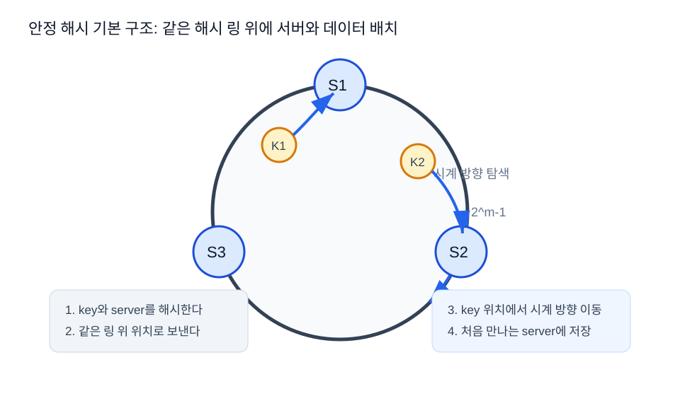
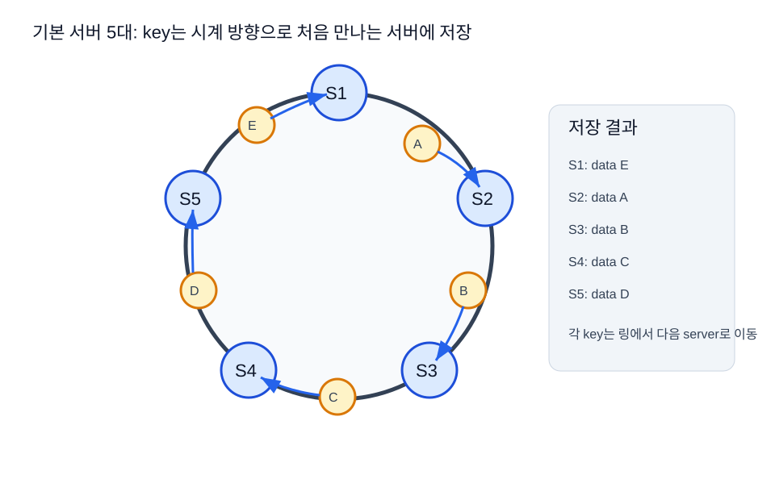
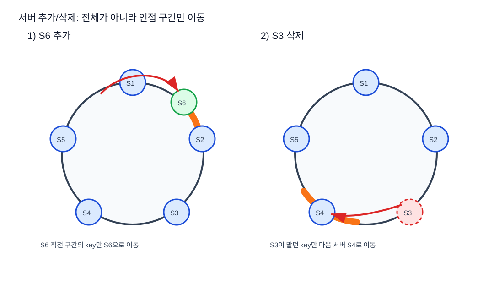
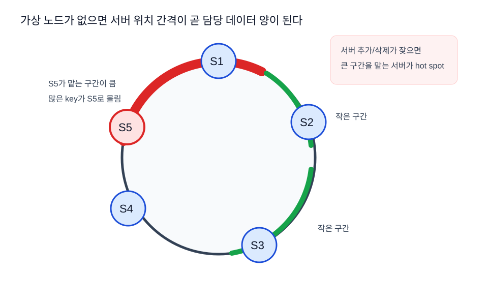
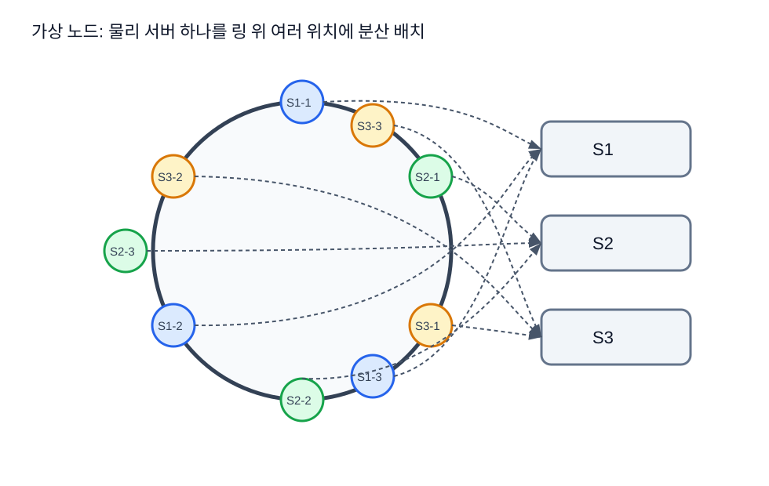
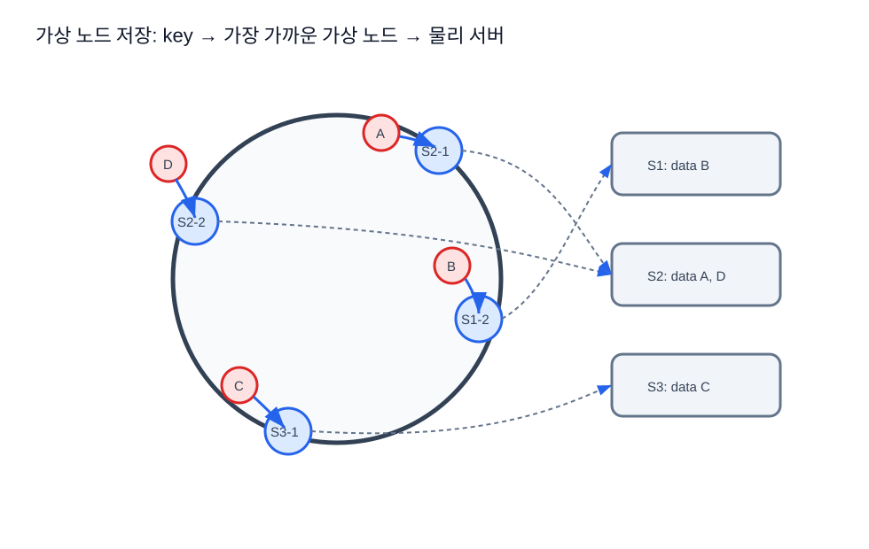
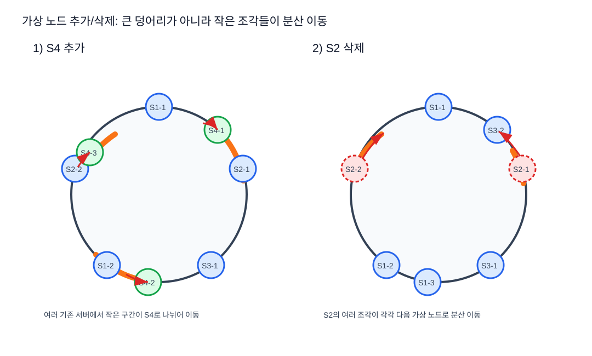

# chapter05-week1-inital-design

## 1. 일반적인 해시 문제점

일반적인 해시 방식은 `hash(key) % 서버 수`처럼 서버 수를 계산식에 직접 넣는다. 이 방식은 단순하지만 서버가 추가되거나 삭제되면 서버 수가 바뀌기 때문에, 기존 키 대부분의 저장 위치가 다시 계산된다.

즉 서버 한 대를 추가했을 뿐인데도 전체 데이터가 다시 섞일 수 있다.

## 2. 안정 해시와 해시 링

안정 해시는 서버 수를 직접 나머지 연산에 넣지 않는다. 대신 키와 서버를 같은 해시 공간에 올리고, 그 해시 공간을 원형 링으로 본다.

해시 링은 특정 해시 함수로 만들어진 일렬의 해시 공간을 끝과 시작이 이어진 원형 구조로 생각한 것이다. 서버도 해시해서 링 위에 배치하고, 데이터 키도 해시해서 링 위에 배치한다. 이후 데이터는 자기 위치에서 시계 방향으로 이동했을 때 가장 먼저 만나는 서버에 저장된다.



### 기본 서버 5대 구조에서 데이터 배치와 저장

서버 5대가 링 위에 있을 때 각 데이터는 자기 해시 위치에서 시계 방향으로 가장 가까운 서버에 저장된다. 아래 예시는 데이터 A~E가 어느 서버에 저장되는지 보여준다.



## 3. 서버 추가/삭제 시 재배치

안정 해시에서는 서버가 추가되거나 삭제되어도 전체 데이터를 다시 배치하지 않는다.

서버가 추가되면 새 서버가 들어간 위치와 그 직전 서버 사이의 키만 새 서버로 이동한다. 서버가 삭제되면 삭제된 서버가 맡던 키만 시계 방향 다음 서버로 이동한다. 나머지 서버가 맡던 데이터는 그대로 유지된다.



## 4. 안정 해시의 문제점

안정 해시는 데이터 재배치를 줄여주지만, 기본 구조만으로는 키가 항상 균등하게 분산된다고 보장하기 어렵다.

물리 서버를 링 위에 한 지점씩만 배치하면 각 서버가 맡는 구간 크기가 우연에 크게 좌우된다. 서버 추가/삭제가 반복되면 어떤 서버는 큰 구간을 맡고, 어떤 서버는 작은 구간만 맡아 부하가 치우칠 수 있다.



## 5. 가상 노드

가상 노드는 물리 서버 하나를 링 위의 여러 지점에 나눠 배치한 것이다. 링에는 `S1-1`, `S1-2`처럼 가상 노드가 올라가지만, 실제 저장과 운영 책임은 물리 서버 S1이 가진다.

가상 노드를 사용하면 한 물리 서버가 하나의 큰 구간이 아니라 여러 작은 구간을 나누어 맡는다. 그래서 특정 서버에만 데이터가 몰릴 가능성을 줄이고, 서버 추가/삭제 시에도 여러 서버에서 작은 조각 단위로 데이터가 이동한다.

### 가상 노드의 실제 서버 배치 구조



### 가상 노드 사용 시 데이터 저장 모습

데이터는 먼저 시계 방향으로 가장 가까운 가상 노드에 배정된다. 이후 그 가상 노드가 가리키는 물리 서버에 실제로 저장된다.



### 가상 노드 사용 시 노드/서버 추가·삭제 변경 범위

가상 노드를 쓰면 물리 서버 하나가 담당하던 범위가 여러 작은 조각으로 나뉜다. 서버를 추가하거나 삭제할 때도 큰 구간 하나가 통째로 이동하는 대신, 여러 서버에서 작은 조각들이 조금씩 이동한다.



## 공식/원문 그림 기준으로 다시 읽기

### 1. Discord 글: 링 구조가 맞아도 조회 경로가 병목이 될 수 있다

- 원문 자료: [How Discord Scaled Elixir to 5,000,000 Concurrent Users](https://discord.com/blog/how-discord-scaled-elixir-to-5-000-000-concurrent-users)
- 같이 볼 그림: [안정 해시 기본 구조](images/01-hash-ring-basic.svg)

Discord는 여러 Erlang 노드에 guild process를 나눠서 올리고 있었다. 여기서 guild는 Discord 서버를 뜻한다. 사용자가 접속하면 session process가 만들어지고, 이 session process는 자신이 들어가 있는 guild들이 어느 Erlang 노드에 있는지 알아야 한다.

이때 Discord는 consistent hashing을 사용해 특정 guild 같은 entity가 어느 노드에 있어야 하는지 찾았다. 즉 안정 해시는 메시지를 저장할 서버를 고르는 용도라기보다, "이 guild process는 어느 Erlang 노드에 있는가?"를 찾는 라우팅 기준으로 쓰였다.

흐름은 단순화하면 다음과 같다.

1. 사용자가 WebSocket으로 접속한다.
2. 사용자의 session process가 만들어진다.
3. session process는 사용자가 속한 guild 목록을 본다.
4. 각 guild id를 key로 보고 consistent hash ring에서 담당 Erlang 노드를 찾는다.
5. session process는 해당 노드의 guild process와 통신한다.

문제는 4번이 너무 자주 실행됐다는 점이다. Discord 글에 따르면 평균 사용자는 약 5개의 guild에 들어가 있고, 세션 서버 하나에는 최대 50만 개의 live session이 있을 수 있었다. 세션 서버가 재시작되거나 사용자가 몰려서 재접속하면, 수많은 session process가 동시에 "이 guild는 어느 노드에 있지?"를 물어본다.

처음 구조에서는 ring을 제어하는 Erlang process가 있었고, 다른 process들이 이 process에 request/reply 방식으로 조회를 요청했다. 이 방식은 구조상 병목이 생기기 쉽다.

```text
session process
  -> ring 담당 process에 guild id 조회 요청
  -> ring 담당 process가 consistent hash ring 조회
  -> 담당 Erlang node 반환
```

프로세스 간 request/reply 자체에도 비용이 있고, ring 담당 process 하나가 너무 바빠지면 전체 시스템이 밀린다. Discord는 이 lookup 비용만으로 세션 서버 재시작 시 수십 초가 걸릴 수 있다고 설명한다.

그래서 먼저 ring 데이터를 ETS에 복사해서 여러 process가 직접 읽게 했다. ETS는 Erlang VM에서 제공하는 빠른 in-memory table이다. 하지만 ring 자료구조가 커서 ETS에서 읽을 때도 복사 비용이 컸고, 여전히 충분히 빠르지 않았다.

최종적으로 Discord는 FastGlobal을 만들었다. FastGlobal은 `mochiglobal` 아이디어를 Elixir 쪽으로 가져온 것이다. 핵심은 ring 데이터를 일반 테이블에 넣는 대신, ring 데이터를 상수처럼 반환하는 모듈을 런타임에 만들어 로드하는 방식이다.

개념적으로는 이런 모듈을 만든다고 보면 된다.

```erlang
ring() ->
    HugeConsistentHashRingData.
```

Erlang VM은 이렇게 컴파일된 모듈 안의 큰 상수 데이터를 module constant pool, 즉 read-only shared heap에 둘 수 있다. 그러면 여러 session process가 ring을 조회할 때 큰 ring 데이터를 매번 복사하지 않고 읽을 수 있다.

정리하면 Discord 사례의 핵심은 안정 해시 알고리즘을 바꾼 것이 아니다. 안정 해시 ring은 그대로 필요했지만, 그 ring을 hot path에서 매번 단일 process나 ETS 복사 경로로 읽으면 병목이 됐다. 그래서 ring을 거의 변하지 않는 read-only 데이터로 보고, 여러 process가 복사 없이 빠르게 읽을 수 있는 구조로 바꾼 것이다.

### 2. Maglev 논문: 로드밸런서는 링보다 빠른 lookup table을 중시한다

- 원문 자료: [Maglev: A Fast and Reliable Software Network Load Balancer](https://research.google/pubs/maglev-a-fast-and-reliable-software-network-load-balancer/)
- 원문 PDF: [Maglev paper](https://static.googleusercontent.com/media/research.google.com/en//pubs/archive/44824.pdf)

Maglev는 분산 저장소가 아니라 로드밸런서 사례다. 그래서 관심사가 조금 다르다. 저장소에서는 "이 key의 데이터를 어느 서버가 책임지는가"가 중요하지만, 로드밸런서에서는 "이 연결을 어느 backend로 빠르게 보낼 것인가"가 중요하다.

Maglev는 backend 선택을 빠르게 하기 위해 큰 lookup table을 만든다. backend가 추가되거나 삭제되어도 기존 연결이 가능한 한 같은 backend로 가게 하면서, 동시에 backend들 사이에 트래픽이 고르게 나뉘도록 설계한다.

따라서 Maglev는 안정 해시를 그대로 저장소처럼 쓰는 예시라기보다, 같은 문제의식을 로드밸런서에 맞게 바꾼 사례로 보면 된다.

- 변경이 생겨도 기존 매핑이 너무 많이 흔들리면 안 된다.
- 특정 backend에 연결이 몰리면 안 된다.
- 매 요청마다 backend를 아주 빠르게 찾아야 한다.


정리하면, 안정 해시 설계에서 꼭 답해야 하는 질문은 다음과 같다.

1. key와 서버를 어떤 해시 함수로 같은 공간에 올릴 것인가?
2. 데이터는 시계 방향 첫 노드에 둘 것인가, 복제까지 고려해 여러 노드에 둘 것인가?
3. 물리 서버 하나당 가상 노드 또는 token을 몇 개 둘 것인가?
4. 가상 노드가 같은 물리 서버를 가리킬 때 복제 중복을 어떻게 막을 것인가?
5. 서버 추가/삭제 시 어느 구간의 데이터만 이동해야 하는가?
6. 링 조회가 요청 hot path에 있다면 lookup 자료구조는 충분히 빠른가?
7. 저장소처럼 데이터 위치가 중요한 시스템인가, 로드밸런서처럼 빠른 backend 선택이 중요한 시스템인가?
