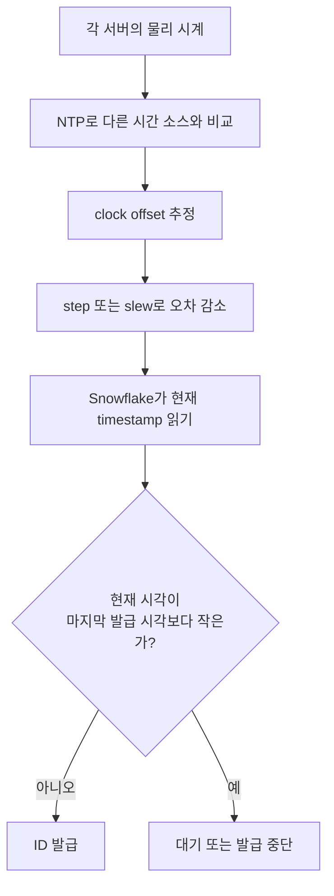
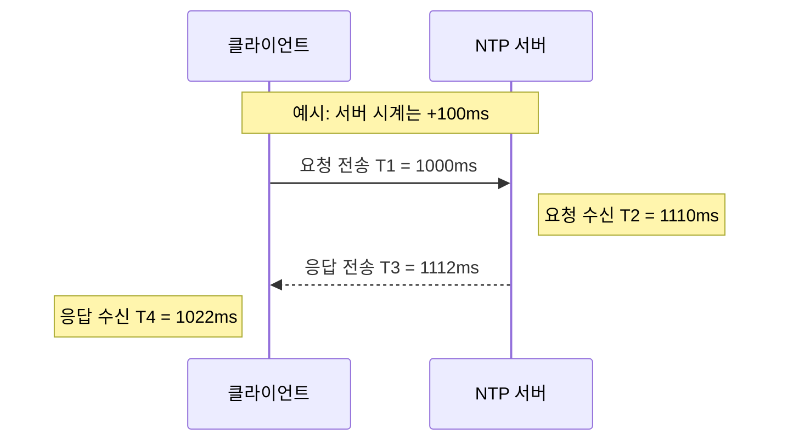
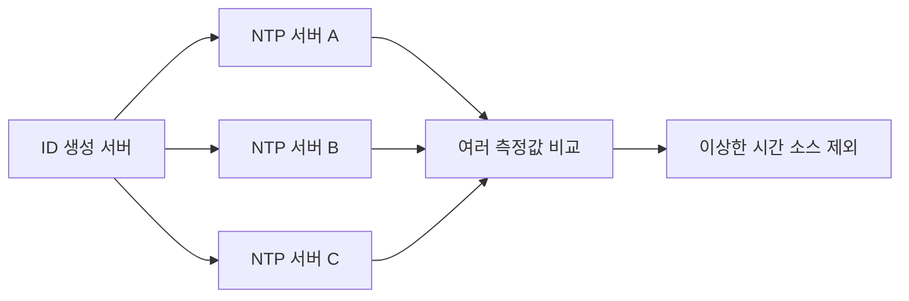

# Network Time Protocol

## 참고문헌

- 책의 참고 링크: [Network Time Protocol](https://en.wikipedia.org/wiki/Network_Time_Protocol)
- 표준: [RFC 5905 - Network Time Protocol Version 4](https://www.rfc-editor.org/rfc/rfc5905)
- NTPsec 공식 설명: [Clock Discipline Algorithm](https://docs.ntpsec.org/latest/discipline.html)

## 7장에서 NTP가 중요한 이유

Snowflake의 ID 상위 비트는 서버의 현재 시각에서 만들어진다. 서버마다 시각이 크게 다르거나 시계가 뒤로 가면 다음 문제가 생긴다.

- 나중에 생성한 ID가 더 작아질 수 있다.
- 같은 worker가 과거의 timestamp와 sequence 조합을 다시 사용할 수 있다.
- 로그, 이벤트, 데이터 정렬 결과가 실제 순서와 달라질 수 있다.

NTP는 네트워크로 연결된 컴퓨터들의 시계 차이를 측정하고 줄이기 위한 프로토콜이다.

## 한 장으로 보는 전체 흐름



NTP와 Snowflake는 맡는 일이 다르다.

- NTP: 서버 시계의 오차를 줄인다.
- Snowflake: 현재 시각을 그대로 믿지 않고 마지막 발급 시각과 비교한다.
- 안전 정책: 시계가 뒤로 갔다면 중복 가능성을 피하기 위해 기다리거나 실패한다.

## 네 개의 timestamp

NTP는 한 번의 요청과 응답에서 네 시각을 사용한다.



| 시각 | 의미 |
|---|---|
| `T1` | 클라이언트가 요청을 보낸 시각 |
| `T2` | 서버가 요청을 받은 시각 |
| `T3` | 서버가 응답을 보낸 시각 |
| `T4` | 클라이언트가 응답을 받은 시각 |

이 값으로 서버와 클라이언트 사이의 clock offset과 왕복 지연을 추정한다.

```text
clock offset θ = 1/2 × [(T2 - T1) + (T3 - T4)]
round-trip delay δ = (T4 - T1) - (T3 - T2)
```

네트워크 요청과 응답의 지연이 완전히 같다는 보장은 없으므로 결과는 정확한 참값이 아니라 추정값이다.

### 숫자로 직접 계산해 보기

그림에는 아래 조건을 넣었다.

- 서버 시계는 클라이언트보다 `100ms` 빠르다.
- 요청이 서버까지 가는 데 `10ms`가 걸린다.
- 서버가 응답을 준비하는 데 `2ms`가 걸린다.
- 응답이 클라이언트까지 오는 데 `10ms`가 걸린다.

clock offset을 계산한다.

```text
θ = 1/2 × [(T2 - T1) + (T3 - T4)]
  = 1/2 × [(1110 - 1000) + (1112 - 1022)]
  = 1/2 × [110 + 90]
  = 100ms
```

`θ = 100ms`이므로 클라이언트 시계가 서버보다 약 `100ms` 느리다고 추정한다.

왕복 지연도 계산한다.

```text
δ = (T4 - T1) - (T3 - T2)
  = (1022 - 1000) - (1112 - 1110)
  = 22 - 2
  = 20ms
```

전체 왕복 시간 `22ms`에서 서버가 처리한 시간 `2ms`를 빼면 실제 네트워크 왕복 지연은 `20ms`로 추정된다.

### 왜 네 개의 timestamp가 필요한가

응답을 받은 시각만 비교하면 네트워크 이동 시간과 서버 처리 시간이 섞인다. `T1~T4`를 모두 보면 clock offset과 round-trip delay를 따로 추정할 수 있다.

- 두 시계가 얼마나 어긋났는가: clock offset
- 패킷이 네트워크를 왕복하는 데 얼마나 걸렸는가: round-trip delay

## step과 slew

시계 차이는 step이나 slew로 보정한다.

- step: 시스템 시각을 목표 시각으로 한 번에 이동한다.
- slew: 시계의 진행 속도를 조절해 점진적으로 차이를 줄인다.

목표 시각은 NTP 서버의 시각을 그대로 복사한 값이 아니다. 네트워크 지연과 여러 번의 측정값으로 구한 `clock offset`을 현재 시스템 시각에 반영한 값이다.

```text
현재 시스템 시각:       12:00:00.500
NTP가 계산한 offset:              -10ms
목표 시각:             12:00:00.490
```

- step을 선택하면 즉시 `12:00:00.490`으로 바꾼다.
- slew를 선택하면 시계가 흐르는 속도를 잠시 조절해 `10ms` 차이를 천천히 줄인다.

시각을 뒤로 step하면 Snowflake 같은 ID 생성기는 마지막으로 본 시각보다 작은 timestamp를 볼 수 있다. slew도 오차를 천천히 줄일 뿐 애플리케이션에 완전한 전역 순서를 제공하지는 않는다.

### step 예시

```text
Snowflake가 마지막으로 사용한 시각: 12:00:00.500
NTP 보정 후 현재 시각:             12:00:00.490

현재 시각 < 마지막 사용 시각
→ 과거 timestamp 구간을 다시 사용할 위험
→ ID 발급을 기다리거나 중단
```

### slew 예시

slew는 시계를 한 번에 뒤로 돌리지 않고 진행 속도를 잠시 늦춰 오차를 줄인다. 갑자기 과거 시각을 읽을 위험은 줄어들지만 오차 자체가 사라지는 것은 아니다.

- 다른 서버와 시각이 완전히 같아지는 것은 아니다.
- 보정 중에는 실제 시간과 시스템 시각의 진행 속도가 다를 수 있다.
- 여러 서버에서 생성한 ID의 엄격한 전체 순서는 보장되지 않는다.

## NTP가 보장하지 않는 것

- 모든 서버의 시각이 완전히 같다는 보장
- 네트워크 지연이 요청과 응답에서 대칭이라는 보장
- 애플리케이션이 관찰하는 시간이 항상 단조 증가한다는 보장
- 여러 서버에서 발생한 이벤트의 엄격한 전체 순서 보장

NTP만으로는 Snowflake의 시계 문제를 해결할 수 없다.

### 단조 증가란

시간을 반복해서 읽어도 다음 값이 이전 값보다 작아지지 않아야 한다. 시계의 해상도 때문에 같은 값이 연속으로 나올 수는 있지만 과거 값으로 돌아가면 안 된다.

```text
1000 → 1001 → 1002 → 1003  정상
1000 → 1001 →  990 →  991  단조 증가 아님
```

NTP의 step 보정이나 관리자의 시스템 시각 변경 때문에 실제 날짜와 시간을 나타내는 wall clock은 뒤로 갈 수 있다. 운영체제가 제공하는 monotonic clock은 경과 시간을 잴 때는 뒤로 가지 않지만 실제 날짜와 시각을 나타내지 않는다. Snowflake가 wall clock을 사용한다면 별도의 clock rollback 검사가 필요하다.

## NTP 서버가 단일 장애점이 될 수 있는가

NTP 서버를 한 대만 사용하면 동기화 품질이 이 서버 한 대에 달린다. 서버가 멈춰도 애플리케이션 서버의 시계는 계속 움직이지만 NTP 보정이 끊긴 시간이 길수록 오차가 커진다.

한 대뿐인 NTP 서버가 잘못된 시각을 제공하는 상황은 더 위험하다. 여러 ID 생성 서버가 같은 잘못된 시각으로 보정될 수 있기 때문이다.



운영 환경에서는 독립적인 시간 소스를 여러 개 둔다. 일부 NTP 서버가 응답하지 않으면 나머지 서버를 사용하고, 측정값을 비교해 이상한 시간 소스를 제외한다. 모든 시간 소스와 연결이 끊겨도 로컬 시계로 동작할 수는 있다. 이때는 동기화 품질이 낮아지므로 offset과 동기화 상태를 감시해야 한다.

## NTP를 써도 남는 문제

두 문제는 NTP를 사용해도 남는다. NTP는 서버들의 시각을 완전히 맞추지 못하며 한 서버의 시스템 시각이 절대 뒤로 가지 않는다고 보장하지도 않는다. 동기화하지 않으면 시계는 더 빠르게 어긋나지만, NTP로도 위험을 없앨 수는 없다. 나머지는 Snowflake가 직접 방어해야 한다.

### 서버끼리 시각이 다른 경우

두 서버가 모두 NTP를 사용해도 네트워크 지연, 동기화 주기, 하드웨어 시계의 오차 때문에 몇 ms 정도 차이가 남을 수 있다.

```text
실제 시각 10:00:00.100: 서버 A에 먼저 요청
서버 A가 읽은 시각: 10:00:00.120 → timestamp 120으로 ID 생성

실제 시각 10:00:00.110: 서버 B에 나중 요청
서버 B가 읽은 시각: 10:00:00.090 → timestamp 90으로 ID 생성

실제 생성 순서: A의 ID → B의 ID
ID 숫자 순서:   B의 ID → A의 ID
```

서버 A와 B의 worker ID가 다르면 두 ID는 겹치지 않는다. 다만 나중에 만든 B의 ID가 더 작아서 생성 순서와 ID 숫자 순서가 어긋난다. Snowflake가 제공하는 시간순 정렬은 대략적인 순서이지 엄격한 전체 순서가 아니다.

### 한 서버의 시각이 뒤로 간 경우

한 서버가 다음 ID를 만들 때 직전보다 작은 시각을 읽을 수도 있다. 이미 발급한 ID가 바뀌는 것은 아니다. 운영체제 시계가 뒤로 이동해서 다음 ID에 넣을 timestamp가 작아진다.

```text
1. worker 3이 읽은 시스템 시각: 1000ms
2. ID 생성기가 timestamp 1000, sequence 0으로 ID 발급
3. NTP가 계산한 offset: -200ms
4. NTP 동기화 데몬이 시계를 800ms로 뒤로 step
5. 다음 요청에서 ID 생성기가 읽은 시각: 800ms

현재 시각 800 < 마지막 발급 시각 1000
```

작은 오차는 보통 시계 속도를 조절하는 slew로 보정하고, 큰 음수 offset은 NTP 동기화 데몬의 설정과 상태에 따라 step으로 처리한다. RFC 5905의 clock discipline 알고리즘은 offset이 step 임계값을 넘으면 시스템 시각을 직접 설정한다. NTPsec 문서에도 예외적인 상황에서는 시스템 시각이 앞이나 뒤로 step될 수 있다고 나와 있다.

이때 Snowflake 구현에 따라 결과가 달라진다.

```text
안전한 구현
현재 시각 800 < 마지막 발급 시각 1000 감지
→ 시계가 1000을 따라잡을 때까지 기다리거나 발급 실패
→ 더 작은 ID와 중복 ID를 발급하지 않음

위험한 구현
시각 역행을 검사하지 않고 timestamp 800으로 ID 발급
→ 이전 ID보다 작은 ID가 만들어짐
→ 시각이 다시 1000에 도달해 sequence 0을 쓰면 이전의 worker 3 ID와 중복 가능
```

시스템 시각이 실제로 뒤로 가더라도 clock rollback 검사를 구현한 Snowflake는 그 시각으로 ID를 만들지 않는다. `현재 시각 < 마지막 발급 시각`이면 시계가 따라잡을 때까지 기다리거나 발급을 멈춘다. 이 검사가 없을 때만 더 작은 ID나 중복 ID가 생긴다.

## ID 생성기에서 추가로 필요한 방어

### 마지막 timestamp 검사

현재 시각이 마지막 ID 생성 시각보다 작은지 확인한다. 작다면 생성하지 않고 기다리거나 오류로 처리한다.

### clock offset 모니터링

NTP daemon의 동기화 상태와 offset이 허용 범위를 넘는지 감시한다. 임계값을 넘으면 해당 worker를 트래픽에서 제외할 수 있다.

### worker ID 중복 방지

시계가 정확해도 두 프로세스가 같은 worker ID와 같은 sequence를 사용하면 충돌할 수 있다. worker ID 임대와 프로세스 생명주기를 함께 관리해야 한다.

### 정렬 요구 수준 확인

Snowflake는 ID를 대략적인 시간순으로 정렬할 때 적합하다. 엄격한 전체 순서가 필요한 합의 로그를 대신하지는 못한다. 이 경우에는 별도의 coordinator, consensus log, 논리 시계 등을 검토해야 한다.

## 자주 헷갈리는 부분

### NTP 서버가 정확한 현재 시각을 그대로 보내 주는가?

단순히 시각 하나만 전달하는 것이 아니다. 요청과 응답의 네 timestamp로 clock offset과 네트워크 지연을 추정한다.

### NTP를 사용하면 모든 서버 시간이 같아지는가?

아니다. 오차를 줄일 뿐 완전히 같은 시각과 엄격한 사건 순서를 보장하지 않는다.

### NTP가 Snowflake ID의 유일성을 보장하는가?

아니다. ID 유일성은 worker ID 중복 방지, sequence 관리, clock rollback 검사까지 함께 동작해야 보장할 수 있다.

## 스스로 확인하기

1. `T1=2000`, `T2=2060`, `T3=2065`, `T4=2015`라면 clock offset은 얼마인가?
2. Snowflake가 마지막으로 본 timestamp보다 작은 현재 시각을 허용하면 왜 중복 가능성이 생기는가?
3. NTP를 사용해도 여러 서버의 ID가 엄격한 시간순으로 정렬되지 않는 이유는 무엇인가?

<details>
<summary>정답 확인</summary>

1. `1/2 × [(2060-2000) + (2065-2015)] = 55ms`다. 왕복 지연은 `(2015-2000) - (2065-2060) = 10ms`다.
2. 같은 worker가 과거의 `timestamp + sequence` 조합을 다시 만들 수 있기 때문이다.
3. NTP는 시계 오차를 줄이는 프로토콜이지 모든 서버에 완전히 동일하고 단조 증가하는 전역 시계를 제공하지 않기 때문이다.

</details>

## 핵심 정리

NTP는 서버 시계의 오차를 줄일 뿐 시간 기반 ID의 유일성까지 책임지지 않는다. Snowflake는 clock rollback을 감지하고, 시각이 역행하면 기다리거나 발급을 멈춰야 한다.
